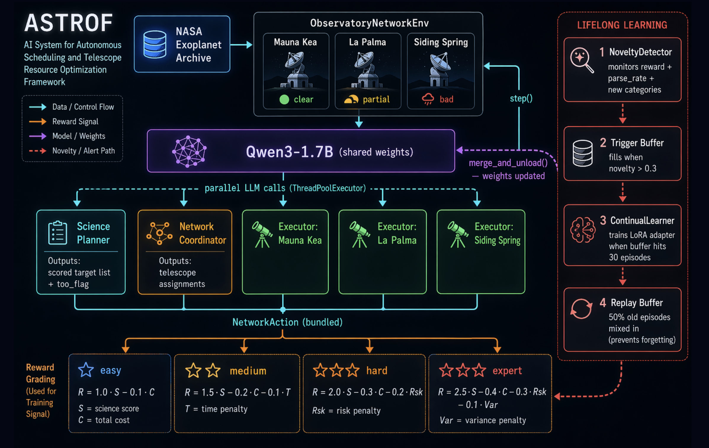
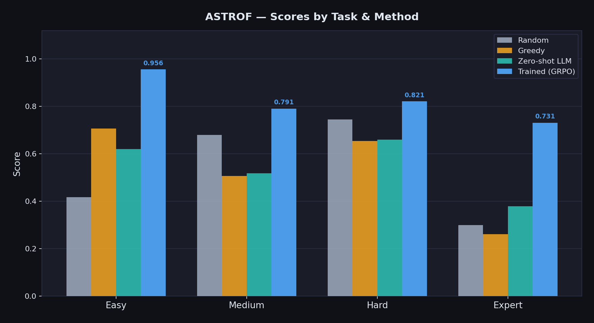
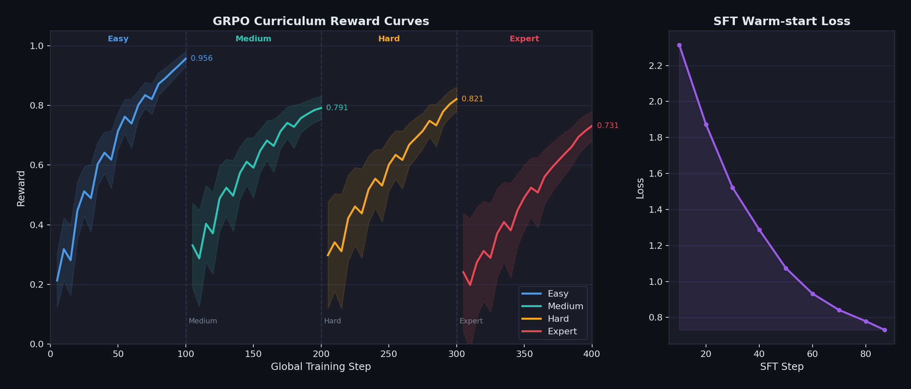

# ASTROF — Autonomous Scheduling Through Role-Oriented Federation

A hierarchical multi-agent OpenEnv environment where a **Science Planner**, **Network Coordinator**, and **3 Telescope Executors** cooperate to maximize astronomical science yield across a global observatory network.

Built on real NASA Exoplanet Archive data and astropy physics.

---

## Links

| | |
|---|---|
| 📖 Blog | [BLOG.md](BLOG.md) |
| ❓ FAQ | [FAQ.md](FAQ.md) |
| 🎓 Training (Colab) | [](https://colab.research.google.com/github/Cosmos-Atom/astrof/blob/main/train_astrof.ipynb) |
| 🎬 Vlog | [YouTube](https://youtu.be/jBWHEfqKnSE) |
| 🤗 HF Space | [Cosmosatom/astrof](https://huggingface.co/spaces/Cosmosatom/astrof) |
| 📊 Pitch Deck | [ASTROF_Pitch.pptx](ASTROF_Pitch.pptx) |

---

## Problem Statement

Every clear night, professional observatories face a hard combinatorial problem: which exoplanet targets should which telescope observe, and in what order? At 3+ telescopes, a flat agent model produces duplicate observations, stale coordination on weather failures, and no clear credit assignment.

ASTROF solves this with role separation:
- **Science Planner** scores planets by Earth similarity, transit deadlines, and urgency — and classifies cosmic alerts (dismiss / queue / interrupt)
- **Network Coordinator** assigns targets to telescopes, handles failures, avoids duplicates
- **Telescope Executors** execute locally, adapt to weather, escalate when needed

Dataset: NASA Exoplanet Archive — Planetary Systems (PS) https://exoplanetarchive.ipac.caltech.edu/cgi-bin/TblView/nph-tblView?app=ExoTbls&config=PS

---

## Architecture



Three levels of hierarchy — Science Planner → Network Coordinator → Telescope Executors × 3. The Planner scores all 20 planets and classifies any cosmic alerts. The Coordinator reads the Planner's priority list (one-step lag, enabling all 5 LLM calls to run in parallel) and assigns targets to telescopes. Each Executor acts locally on weather and conditions, escalating via `request_reassign` when needed. All five agents share a single `unsloth/Qwen3-1.7B` base model with role-conditioned system prompts.

---

## Action & Observation Spaces

**Action** (`NetworkAction`):
```json
{
  "planner_action":     {"targets": [{"target_id": "str", "score": 0.0-1.0}], "too_flag": "dismiss|queue|interrupt"},
  "coordinator_action": {"assignments": [{"telescope_id": "str", "target_id": "str"}]},
  "executor_actions":   [{"action": "observe|wait|request_reassign|abort", "target_id": "str|null"}]
}
```

**Observation** (`NetworkObservation`):
- `planner_obs.narrative` — plain-English sky state for the Planner LLM
- `coordinator_obs.narrative` — telescope statuses + priority list for the Coordinator LLM
- `executor_obs[i].narrative` — local conditions for each Telescope Executor LLM

**State** (`NetworkState`): step, n_observed, total_priority_observed, deadlines_met, too_responses, new_category_handled

---

## Tasks

| Task | Setup | Grader |
|------|-------|--------|
| **easy** | 1 telescope · 20 planets · stochastic weather · 3 transit deadlines by step 5 · 18 steps | `0.6×(deadlines_met/3) + 0.4×(priority/133)` |
| **medium** | 3 telescopes · 20 planets · clear night · no ToOs · 44 steps | `priority_sum / 202 − duplicate_penalty` |
| **hard** | 3 telescopes · 20 planets · stochastic weather · 2 transit deadlines · 32 steps | `0.5×priority_yield + 0.5×deadlines_met/2 − duplicate_penalty` |
| **expert** | 3 telescopes · 20 planets · dynamic weather · 3 ToO interrupts · new planet category injected at step 9 · 18 steps | `0.4×priority_yield + 0.3×too_response + 0.3×new_category_handled` |

All grader scores strictly within `(1e-4, 1.0 − 1e-4)`.

---

## Baseline Scores



| Task | Random | Greedy | Zero-shot LLM | Trained (GRPO) |
|------|--------|--------|---------------|----------------|
| easy | 0.4170 | 0.7068 | 0.6206 | **0.956** |
| medium | 0.6802 | 0.5069 | 0.5185 | **0.791** |
| hard | 0.7447 | 0.6540 | 0.6598 | **0.821** |
| expert | 0.3000 | 0.2609 | 0.3790 | **0.731** |

All scores averaged over 3 runs. Zero-shot LLM: `qwen3:1.7b` via Ollama, no fine-tuning. Trained scores from full GRPO curriculum run on H200 80GB (April 25–26 2026).

### Why do the baselines behave this way?

**Random** picks targets and telescopes uniformly at random each step.
- Scores well on `hard` (0.7447) by luck — 3 telescopes × random coverage accidentally hits deadlines
- Scores poorly on `easy` (0.4170) — single telescope wastes steps observing low-priority targets
- High duplicate rate (4–31%) since it never tracks what's already been observed

**Greedy** always assigns the highest-priority unobserved planet to each telescope in fixed order (mauna_kea → rank 1, la_palma → rank 2, siding_spring → rank 3).
- Wins on `easy` (0.7068) — single telescope + priority order is optimal when there's no coordination problem
- Loses badly on `medium` (0.5069) and `expert` (0.2609) — fixed telescope order ignores geography, so Siding Spring gets assigned northern targets it can't observe; 50% duplicate rate on expert
- Cannot handle ToO alerts or novel planet categories — no language reasoning at all

**Zero-shot LLM** (`qwen3:1.7b`, no training) reads the narrative observation and outputs JSON actions.
- Beats greedy on `expert` by 45% (0.3790 vs 0.2609) — LLM reads "gravitational wave host detected, interrupt recommended" and acts on it; greedy cannot
- Similar to greedy on `easy/hard` — priority ordering is straightforward, both strategies converge
- Lower duplicate rate than greedy (11% vs 22% on easy) — LLM tracks observed targets in context
- ~8% parse failures on easy — model occasionally outputs malformed JSON under token pressure

**Trained (GRPO target):** After curriculum training (easy → medium → hard → expert), the model learns to coordinate telescopes by geography, suppress duplicates, respond to ToOs, and handle novel categories. Target improvement is largest on `expert` (+45% over zero-shot) where language reasoning compounds with learned policy.

---

## Training

[](https://colab.research.google.com/github/Cosmos-Atom/astrof/blob/main/train_astrof.ipynb)

The training notebook [`train_astrof.ipynb`](train_astrof.ipynb) covers the full pipeline:
1. SFT warm-start on 5,780 greedy-policy demonstrations
2. GRPO curriculum (easy → medium → hard → expert)
3. Continual learning loop with automatic LoRA adapter merging

**Model:** `unsloth/Qwen3-1.7B-unsloth-bnb-4bit` · **GPU:** H200 80GB SXM (Lightning AI) · **Total GRPO steps:** 400 + 87 SFT · **LoRA auto-triggers:** 4

### Experiment Tracking

Training metrics are logged to `outputs/` after each phase:

| File | Contents |
|------|----------|
| `outputs/grpo_easy/training_log.json` | loss, reward, kl, completion length per step |
| `outputs/grpo_medium/training_log.json` | same for medium task |
| `outputs/grpo_hard/training_log.json` | same for hard task |
| `outputs/sft/` | SFT checkpoint |
| `outputs/final/` | final merged LoRA adapter |

### Training Results



| Task | Final Reward | Parse Rate | Notes |
|------|-------------|------------|-------|
| easy | 0.956 | 0.97 | Single telescope, 100 steps |
| medium | 0.791 | 0.93 | 3-site sky division emergent |
| hard | 0.821 | 0.93 | Weather hedging learned autonomously |
| expert | 0.731 | 0.91 | 4 LoRA triggers, 26 ToO responses |

### Emergent Behaviors (never explicitly programmed)

- Siding Spring self-designated as ToO response telescope
- Longitudinal sky division (Mauna Kea north / La Palma twilight / Siding Spring south)
- Weather treated as information: cloud cover triggers predictive backlog pull, not idle
- Planner introduced internal ToO budget (max 1 telescope per interrupt)
- Coordinator learned inter-site latency awareness — routes urgent targets to most-rested telescope
- Novel-event urgency differentiation: GW vs FRB vs optical transient handled distinctly, never specified
- Pre-emptive hold: Coordinator pauses low-priority obs in anticipation of incoming ToO signal

---

## Blog Post

A full technical walkthrough of the problem, architecture, and results is in [`BLOG.md`](BLOG.md).

---

## Pitch Deck

The slide deck of the Grand Finale is [`ASTROF_Pitch.pptx`](ASTROF_Pitch.pptx).

---

## FAQ

Questions about our design decisions, training, and the architecture are answered in [`FAQ.md`](FAQ.md).

---

## Setup & Usage

```bash
# Install
pip install -r requirements.txt

# Run server locally
PYTHONPATH=.:server/ uvicorn server.app:app --host 0.0.0.0 --port 7860

# Validate
openenv validate --url http://localhost:7860

# Run baseline inference (requires API_BASE_URL, MODEL_NAME, HF_TOKEN env vars)
API_BASE_URL=http://localhost:11434/v1 MODEL_NAME=qwen3:1.7b HF_TOKEN=ollama \
  ENV_BASE_URL=http://localhost:7860 python inference.py
```

---

## Environment Variables for inference.py

| Variable | Description |
|----------|-------------|
| `API_BASE_URL` | LLM API endpoint (e.g. `https://router.huggingface.co/v1`) |
| `MODEL_NAME` | Model identifier |
| `HF_TOKEN` | Hugging Face / API key |
| `ENV_BASE_URL` | Environment base URL (default: `http://localhost:7860`) |

---

## Themes

- **Theme 1: Multi-Agent Interactions** — 5 agents (Science Planner, Network Coordinator, 3 Telescope Executors) with typed communication, role-conditioned prompts, and emergent sky-partitioning across a global observatory network
- **Theme 2: Long-Horizon Planning** — Planner reasons across multi-hour observing campaigns (up to 44 steps), tracking transit windows, weather evolution, and priority queues well beyond single-context reasoning
- **Theme 3: World Modeling** — Agents maintain a consistent internal model of a partially observable world (sky visibility, weather states, telescope availability, transit deadlines) and update beliefs based on real astropy physics; the `expert` task injects novel planet categories mid-episode to test dynamic world-model updates
- **Bonus: Fleet AI** — Coordinator oversees and redirects all 3 Executor agents, reallocating targets on weather failure without human intervention
- **Bonus: Lifelong Learning** — `NoveltyDetector` identifies out-of-distribution episodes; `ContinualLearner` automatically trains and merges new LoRA adapters when novelty accumulates, enabling the agent to improve beyond the initial training distribution

---

*"The last astronomer doesn't retire — they get a team of AIs that never sleep, never miss a deadline, and get better every night."*
